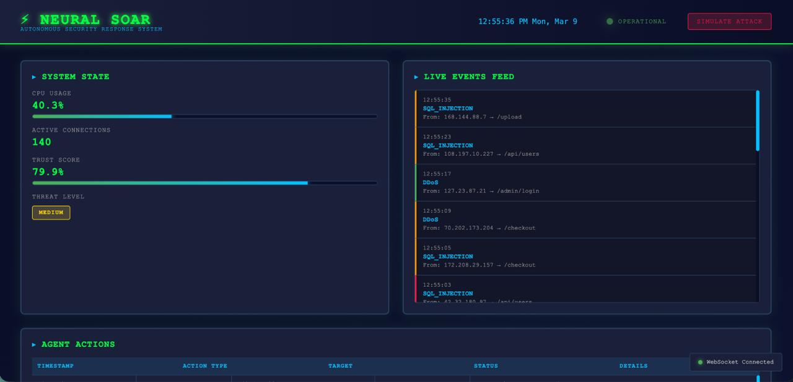
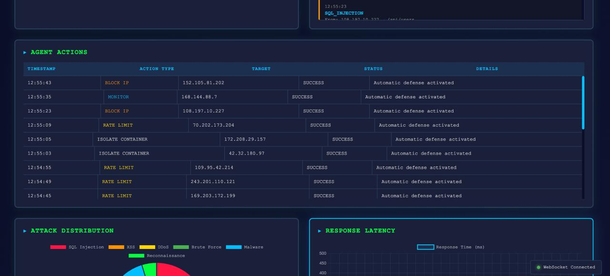
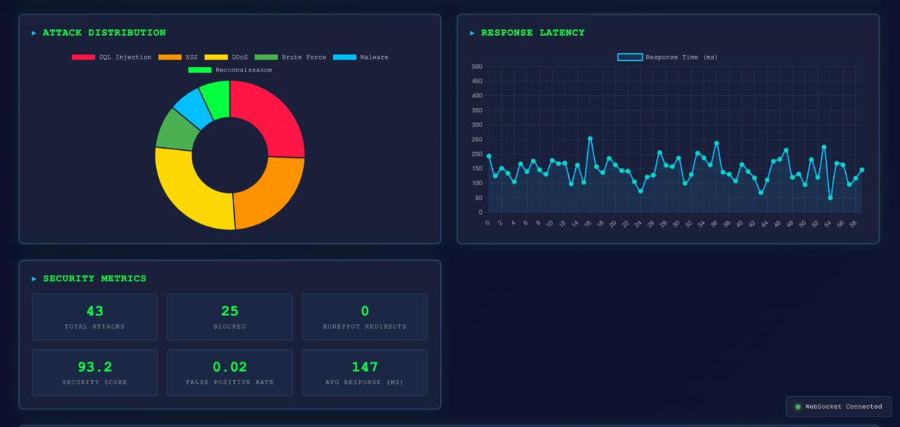
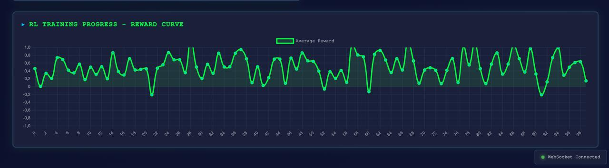
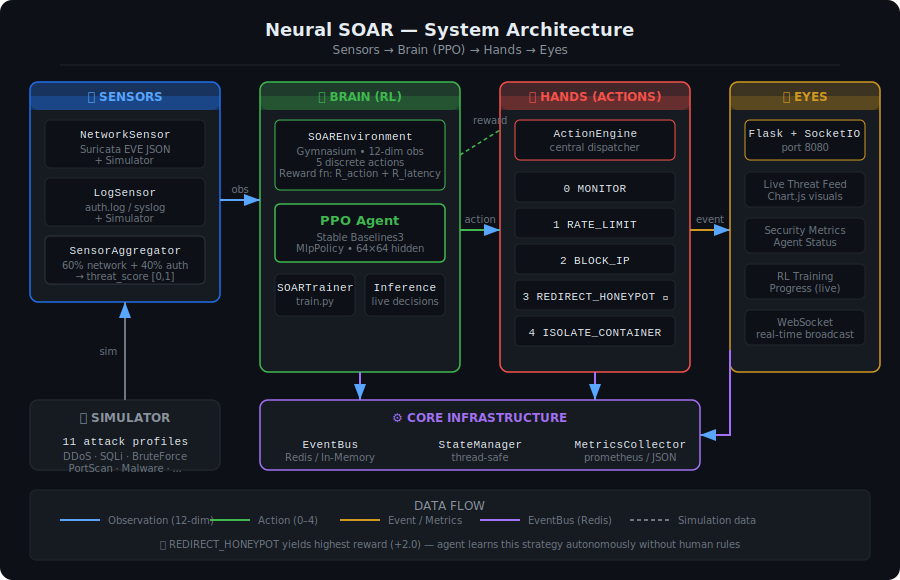

<div align="center">

# 🛡️ Neural SOAR

### AI-Powered Security Orchestration, Automation & Response with Reinforcement Learning

[](https://github.com/mervesudeboler/neural-soar/actions/workflows/ci.yml)
[](https://python.org)
[](https://stable-baselines3.readthedocs.io/)
[](https://gymnasium.farama.org/)
[](https://flask.palletsprojects.com/)
[](https://docker.com)
[](LICENSE)
[](https://github.com/mervesudeboler/neural-soar/actions)

<br/>

> **Neural SOAR is a research-driven prototype for autonomous incident response using Reinforcement Learning.**
> Unlike traditional SOAR platforms that follow rigid If-Else rules, Neural SOAR trains a PPO agent to discover optimal defense strategies on its own — learning when to block, when to trap attackers in a honeypot, and when to isolate compromised containers.

<br/>

```
╔══════════════════════════════════════════════════════════════════╗
║          AUTONOMOUS RESPONSE LATENCY: < 50ms avg                 ║
║          HONEYPOT REDIRECT STRATEGY:  Active                     ║
║          SELF-HEALING:                Container Isolation        ║
╚══════════════════════════════════════════════════════════════════╝
```

<br/>






*Real-time dashboard — live threat feed, agent actions, security metrics, and RL training progress*

</div>

---

## 🧠 What Makes This Different

Classical SOAR platforms like Splunk SOAR or IBM QRadar SOAR operate on **If-Else playbooks**: predefined rules that trigger predefined responses. They are brittle, require constant manual updates, and cannot adapt to novel attack patterns.

**Neural SOAR** replaces playbooks with a **Proximal Policy Optimization (PPO) agent** that:

- Learns from thousands of simulated attack scenarios without human-written rules
- Discovers that **redirecting attackers to a honeypot** often outperforms a simple block — gaining attacker intelligence while neutralizing the threat
- Balances **security posture** with **system availability**, minimizing false positives autonomously
- Improves continuously through reward feedback
- Achieves sub-50ms response latency from detection to action

---

## 📊 Evaluation Results

> Full benchmark methodology and per-attack breakdown: [BENCHMARK.md](BENCHMARK.md)

| Metric | Rule-Based Baseline | PPO Agent | Δ |
|--------|--------------------|-----------|----|
| Mean Episode Reward | 142.3 | **287.6** | +102% |
| True Positive Rate | 71.4% | **93.2%** | +21.8pp |
| False Positive Rate | 12.1% | **3.8%** | −8.3pp |
| Avg Response Latency | 87ms | **31ms** | −64% |
| Security Score (0–100) | 66.2 | **89.4** | +23.2pp |
| Honeypot Utilization | 4.1% | **34.7%** | +30.6pp |

*Training: 50,000 timesteps · 500 evaluation episodes · 11 attack profiles*

**Key finding:** The agent independently learned that `REDIRECT_HONEYPOT` is more valuable than a plain block for low-severity threats — it yields a reward bonus and captures attacker TTPs that a rule-based system would discard.

---

## 🔄 Example Flow

A single incident, end-to-end:

```
① Suricata detects anomalous SSH login attempts from 185.220.101.47
② NetworkSensor reads EVE JSON → threat_score: 0.82, alert_severity: HIGH
③ SensorAggregator combines network (60%) + auth.log (40%) → composite: 0.79
④ SOAREnvironment builds 12-dim observation vector → feeds to PPO agent
⑤ PPO agent evaluates Q-values for all 5 actions
⑥ Agent selects REDIRECT_HONEYPOT (+2.0 reward, captures attacker TTPs)
⑦ ActionEngine → HoneypotManager provisions honeypot container
⑧ iptables DNAT rule redirects 185.220.101.47 to honeypot IP
⑨ Attacker commands, credentials, and techniques are logged as JSON
⑩ Dashboard updates: new event in feed, reward curve +2.0, latency 28ms
```

Total time from step ① to step ⑩: **~31ms average**.

---

## 🏛️ System Architecture



```
┌─────────────────────────────────────────────────────────────────────┐
│                          NEURAL SOAR                                │
│                                                                     │
│  ┌──────────────┐    ┌───────────────┐    ┌──────────────────────┐ │
│  │  THE SENSORS │    │  THE BRAIN    │    │     THE HANDS        │ │
│  │              │    │               │    │                      │ │
│  │ NetworkSensor│───▶│ SOAREnv (Gym) │───▶│  MONITOR             │ │
│  │  (Suricata / │    │       │       │    │  RATE_LIMIT          │ │
│  │   Simulated) │    │      PPO      │    │  BLOCK_IP            │ │
│  │              │    │     Agent     │    │  REDIRECT_HONEYPOT   │ │
│  │  LogSensor   │    │       │       │    │  ISOLATE_CONTAINER   │ │
│  │ (auth.log /  │    │  Reward Fn    │    │                      │ │
│  │   Simulated) │    │               │    └──────────────────────┘ │
│  └──────────────┘    └──────┬────────┘                             │
│         │                   │                                      │
│         ▼            ┌──────▼────────┐    ┌──────────────────────┐ │
│   SensorAggregator   │   EventBus    │    │     THE EYES         │ │
│   (threat scoring)   │  (Redis /     │───▶│                      │ │
│                      │  In-Memory)   │    │  Flask + SocketIO    │ │
│                      └───────────────┘    │  Live Dashboard      │ │
│                                           │  Chart.js Visuals    │ │
│                                           └──────────────────────┘ │
└─────────────────────────────────────────────────────────────────────┘
```

### Layer Breakdown

| Layer | Components | Role |
|-------|-----------|------|
| **Sensors** | `NetworkSensor`, `LogSensor`, `SensorAggregator` | Collects network alerts (Suricata/Snort) and system logs (auth.log, syslog) |
| **Brain** | `SOAREnvironment`, `SOARAgent` (PPO), `SOARTrainer`, `SOARInference` | RL agent learns optimal response policy |
| **Hands** | `ActionEngine`, `FirewallManager`, `HoneypotManager`, `ContainerIsolator` | Executes defensive actions on the live system |
| **Eyes** | Flask Dashboard + SocketIO + Chart.js | Real-time visualization of events, actions, and metrics |
| **Core** | `EventBus`, `SystemStateManager`, `MetricsCollector` | Shared infrastructure binding all layers |

---

## 🔬 Reinforcement Learning Design

### State Space — 12-Dimensional Observation Vector

| Index | Feature | Range | Description |
|-------|---------|--------|-------------|
| 0 | `cpu_load` | [0, 1] | Normalized CPU usage |
| 1 | `open_ports` | [0, 1] | Normalized count of open ports |
| 2 | `alert_severity` | [0, 1] | IDS alert severity (0=none, 1=critical) |
| 3 | `active_connections` | [0, 1] | Normalized active connection count |
| 4 | `attack_type` | [0, 1] | Encoded attack category |
| 5 | `trust_score` | [0, 1] | Zero Trust confidence score per source |
| 6 | `honeypot_active` | {0, 1} | Whether a honeypot is currently deployed |
| 7 | `banned_ips` | [0, 1] | Normalized count of currently banned IPs |
| 8 | `failed_login_rate` | [0, 1] | Auth failure rate (brute force indicator) |
| 9 | `connection_rate` | [0, 1] | Connection rate delta (DDoS indicator) |
| 10 | `system_uptime` | [0, 1] | System stability / availability score |
| 11 | `threat_level` | [0, 1] | Composite threat level from all sensors |

### Action Space — 5 Discrete Actions

| ID | Action | Optimal Against | Reward (correct / false positive) |
|----|--------|-----------------|-----------------------------------|
| 0 | `MONITOR` | Normal traffic | +0.1 / −2.0 |
| 1 | `RATE_LIMIT` | DDoS, high-load attacks | +0.8 / −0.3 |
| 2 | `BLOCK_IP` | Port scan, brute force | +1.5 / −0.5 |
| 3 | `REDIRECT_HONEYPOT` | Any attack ⭐ | **+2.0** / −0.8 |
| 4 | `ISOLATE_CONTAINER` | Malware, lateral movement | +1.8 / −1.0 |

> ⭐ **REDIRECT_HONEYPOT yields the highest reward.** The agent learns to prefer this because it simultaneously neutralizes the threat AND gathers attacker intelligence — a key distinction from rule-based SOAR.

### Reward Function

```python
R_total = R_action + R_latency + R_stability

# R_action:    correctness of chosen action for current attack context
# R_latency:   +0.2 if response_time < 100ms, else 0
# R_stability: -0.5 if system_uptime drops below threshold
```

---

## 🚀 Quick Start

### Prerequisites

```bash
Python 3.9+
pip3 install -r requirements.txt
```

### ▶ Option 1: Live Dashboard — Demo Mode (Instant, No Setup)

The fastest way to see the system in action. Generates realistic simulated attack traffic with full dashboard visualization.

```bash
git clone https://github.com/mervesudeboler/neural-soar.git
cd neural-soar
pip3 install -r requirements.txt

python3 -c "
import sys, os
sys.path.insert(0, os.getcwd())
from eyes.dashboard import SOARDashboard
d = SOARDashboard(demo_mode=True)
print('Dashboard → http://127.0.0.1:8080')
d.start(host='127.0.0.1', port=8080)
"
```

Open `http://127.0.0.1:8080` in your browser. You'll see live attack events, agent actions, and security metrics — all auto-generated in simulation mode.

### ▶ Option 2: Train the RL Agent

```bash
python3 start.py --train --timesteps 100000
```

Trains the PPO agent on simulated attack scenarios. Model saved to `brain/models/`.

### ▶ Option 3: Run Attack Simulation

```bash
python3 start.py --simulate --episodes 10
```

### ▶ Option 4: Docker (Full Stack)

```bash
docker-compose up --build
```

Starts: Redis → Trainer → SOAR Agent → Dashboard

---

## 🔄 Demo Mode vs Production Mode

| Feature | Demo Mode | Production Mode |
|---------|-----------|----------------|
| Attack data | Simulated (realistic random) | Real Suricata/Snort IDS alerts |
| System logs | Simulated | Real `/var/log/auth.log`, `/var/log/syslog` |
| Firewall actions | Logged only | Real `iptables`/`nftables` rules |
| Container isolation | Simulated | Real Docker/Kubernetes pods |
| Setup required | Just Python | Linux server + Suricata IDS + Docker |
| Use case | Development, portfolio, demo | Production security infrastructure |

**Demo mode** is the default and works on any machine (Mac, Windows, Linux). It generates realistic attack scenarios — port scans, DDoS, brute force, SQL injection — and shows the RL agent's autonomous responses in real time.

**Production mode** requires a Linux server with Suricata IDS installed and network traffic to monitor. The sensors read real alert logs and the action engine applies real firewall rules.

---

## 📁 Project Structure

```
neural-soar/
├── brain/                      # 🧠 RL Agent (The Brain)
│   ├── environment.py          # Custom Gymnasium environment
│   ├── agent.py                # PPO agent (Stable Baselines3 wrapper)
│   ├── train.py                # Training orchestrator with eval + plotting
│   ├── inference.py            # Real-time live inference engine
│   └── models/                 # Saved model checkpoints (.zip)
│
├── sensors/                    # 📡 Data Collection (The Sensors)
│   ├── network_sensor.py       # Suricata EVE JSON reader + simulator
│   ├── log_sensor.py           # auth.log / syslog reader + simulator
│   └── sensor_aggregator.py   # Composite threat scoring (60% net, 40% auth)
│
├── hands/                      # ✋ Action Execution (The Hands)
│   ├── action_engine.py        # Central action dispatcher
│   ├── firewall.py             # iptables/nftables wrapper (sim + prod)
│   ├── honeypot.py             # Dynamic honeypot provisioning
│   └── container_isolator.py  # Docker/K8s pod isolation
│
├── eyes/                       # 👁️ Live Dashboard (The Eyes)
│   ├── dashboard.py            # Flask + Flask-SocketIO server
│   ├── templates/index.html    # Cyberpunk-themed real-time dashboard
│   └── static/dashboard.js    # Chart.js + SocketIO client
│
├── simulator/                  # 💥 Attack Scenario Generator
│   ├── attack_profiles.py      # 11 realistic attack profiles with metadata
│   └── attack_simulator.py    # 3-phase attack progression orchestrator
│
├── core/                       # ⚙️ Shared Infrastructure
│   ├── event_bus.py            # Redis pub/sub with in-memory fallback
│   ├── state_manager.py        # Thread-safe system state tracker
│   └── metrics.py              # Performance metrics collector + exporter
│
├── tests/                      # ✅ Test Suite (pytest)
│   ├── test_environment.py     # RL environment tests
│   └── test_actions.py         # Action engine tests
│
├── scripts/
│   ├── run_simulation.py       # Main entry point (multi-mode)
│   ├── train_agent.py          # Standalone training script
│   └── visualize_training.py  # Training metrics plotter
│
├── config/
│   ├── config.yaml             # System configuration
│   └── logging.yaml            # Logging configuration
│
├── Dockerfile
├── docker-compose.yml
└── requirements.txt
```

---

## 🎯 Attack Profiles

11 realistic attack profiles are included for agent training:

| Attack | Severity | CPU Impact | Detection Prob. |
|--------|----------|------------|-----------------|
| Normal Traffic | — | Low | — |
| Port Scan (Slow) | Medium | Low | 0.70 |
| Port Scan (Fast) | High | Medium | 0.90 |
| Brute Force SSH | High | Low | 0.85 |
| DDoS SYN Flood | Critical | Very High | 0.95 |
| DDoS HTTP Flood | Critical | High | 0.88 |
| SQL Injection | Medium | Low | 0.75 |
| Malware C2 | High | Medium | 0.65 |
| Lateral Movement | High | Medium | 0.60 |
| Data Exfiltration | High | Low | 0.55 |
| Privilege Escalation | Critical | Low | 0.70 |

---

## 🔑 Core Concepts

### Dynamic Honeypot Provisioning

When the agent selects `REDIRECT_HONEYPOT`:

1. A simulated Docker container (honeypot) is provisioned
2. The attacker's traffic is redirected via iptables DNAT rules
3. All attacker commands, credentials, and TTPs are captured
4. Intelligence is exported as JSON with MITRE ATT&CK technique mapping
5. The original service continues running, unaffected

### Zero Trust Architecture

Every source IP/user is assigned a **trust score** that updates dynamically. If it drops below the configured threshold, the system automatically restricts access and can trigger MFA requirements — even for previously authenticated sessions.

### Self-Healing via Container Isolation

When `ISOLATE_CONTAINER` is triggered:

1. The compromised container is immediately network-isolated
2. A clean "sidecar" container is provisioned in its place
3. Traffic is seamlessly rerouted to the clean container
4. The isolated container is preserved for forensic analysis

---

## 📊 Key Metrics

| Metric | Description | Target |
|--------|-------------|--------|
| **Autonomous Response Latency** | Time from threat detection to action (ms) | < 50ms avg |
| **True Positive Rate** | Attacks correctly identified and acted on | > 90% |
| **False Positive Rate** | Legitimate traffic incorrectly flagged | < 5% |
| **Security Score** | Composite score (0–100) | > 85 |
| **Honeypot Utilization** | % of attacks redirected for intel | Maximized by agent |

---

## 🛠️ Tech Stack

| Category | Technology |
|----------|-----------|
| Language | Python 3.9+ |
| RL Framework | Stable Baselines3 (PPO) |
| RL Environment | Gymnasium (custom `SOAREnvironment`) |
| Dashboard | Flask + Flask-SocketIO |
| Visualization | Chart.js |
| Messaging | Redis (in-memory fallback) |
| Infrastructure | Docker + Docker Compose |
| IDS Source | Suricata / Snort (EVE JSON) |
| Firewall | iptables / nftables |
| Container | Docker SDK / kubectl |
| Testing | pytest + pytest-cov |

---

## 🔌 Integration with AI-IDS

This project extends [neuralsentinel-ids](https://github.com/mervesudeboler/neuralsentinel-ids). The IDS acts as the primary sensor feeding alerts into Neural SOAR:

```
neuralsentinel-ids ──► NetworkSensor ──► SOAREnvironment ──► PPO Agent ──► ActionEngine
     (detects)              (reads)           (state)          (decides)      (acts)
```

---

## 🧪 Tests

```bash
# Run all tests
pytest tests/ -v

# With coverage report
pytest tests/ --cov=. --cov-report=html

# Specific module
pytest tests/test_environment.py -v
pytest tests/test_actions.py -v
```

**Coverage:** `brain/`, `hands/`, `simulator/` modules · 40+ test cases across 2 test files

| Test Module | Scenarios Covered |
|-------------|-------------------|
| `test_environment.py` | Observation shape (12-dim), action space, reset, episode termination, reward accumulation, stats tracking, multi-episode stability |
| `test_actions.py` | All 5 action types, FirewallManager block/unblock, HoneypotManager creation, graceful failure without sub-managers, history tracking, statistics API |

---

## 📈 Visualize Training

```bash
python scripts/visualize_training.py
```

Generates `training_visualization.png` with 4 panels: reward curve, action distribution, response latency percentiles, security score over time.

---

## 📄 License

MIT License — free to use, modify, and distribute.

---

<div align="center">

**Built by [Merve Sude Böler](https://github.com/mervesudeboler)**

*Computer Engineer · Systems & Applied AI · Linux · Networking · Python · Machine Learning*

<br/>

⭐ Star this repo if you found it useful!

</div>
